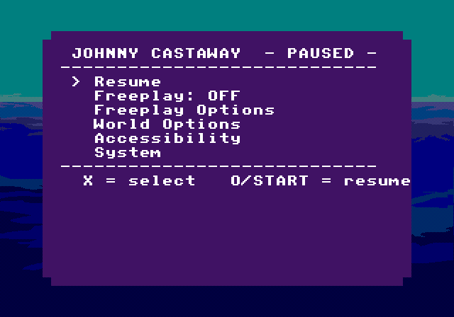

# Johnny Castaway — PlayStation 1

**Website: [hunterdavis.com/johnny-castaway-ps1](https://hunterdavis.com/johnny-castaway-ps1/)** — the full project site, with screenshots, scene ledger, deep dives, devlog, and history. *This README is the short version.*

A ground-up PS1 port of Sierra's classic *Johnny Castaway* screen saver,
using a hybrid scene-playback pipeline: desktop host is the authoritative
renderer and capture source; the PS1 runtime replays authored foreground
packs + captured SFX and owns only the narrow surface it must (background,
wave animation, holiday overlay, input, SPU).

<p align="center">
  
  
  
</p>

<p align="center">
  <code>FISHING 1</code> on PS1, captured from DuckStation: daytime cast · raft variant · night variant.
</p>

<p align="center">
  
</p>

<p align="center">
  Press <strong>START</strong> mid-scene for the pause menu — Resume, Options (sound, day/night, tide, raft, holiday, captions, perf log, plus Set Time/Date · Set Island Pos · Set RNG Seed editors), Save Settings to Memcard, Reset Current Scene, Next Scene, Debug Info.
</p>

<p align="center">
  
</p>

<p align="center">
  Thirty-two added holiday emblems packed into the PS1 holiday sprite sheet.
</p>

<p align="center">
  
</p>

<p align="center">
  Closed captions toggle from <strong>Pause → Options → Captions: ON</strong>. A dark band appears at the bottom of the frame for ~5 seconds at scene start with descriptive subtitle text — accessibility-first and tied to the original Sierra scene-by-scene caption corpus.
</p>

## Where to read more

The website is the canonical surface — most of what's below is mirrored
there with proper cross-linking, prose context, and per-section depth:

- **[/play/](https://hunterdavis.com/johnny-castaway-ps1/play/)** — download + DuckStation quickstart + controls.
- **[/about/method/](https://hunterdavis.com/johnny-castaway-ps1/about/method/)** — hybrid pipeline deep-dive.
- **[/scenes/](https://hunterdavis.com/johnny-castaway-ps1/scenes/)** — live ledger of all 63 scenes + per-scene case studies.
- **[/archaeology/](https://hunterdavis.com/johnny-castaway-ps1/archaeology/)** — the full 5-chapter project story.
- **[/devlog/](https://hunterdavis.com/johnny-castaway-ps1/devlog/)** — dated worklogs preserved verbatim.
- **[/lab/](https://hunterdavis.com/johnny-castaway-ps1/lab/)** — magazine-length essays on methodology (LLM-assisted dev, hallucination control, build farm, regression practice).
- **[/hack/](https://hunterdavis.com/johnny-castaway-ps1/hack/)** — for curious hackers: learning C from this codebase, porting Johnny to a new platform, the printf-driven perf loop, the visual-debug script catalog.
- **[/docs/](https://hunterdavis.com/johnny-castaway-ps1/docs/)** — every reference manual: build, captions, holidays, pause menu, freeplay, regtest, API mapping, the SDL2-compat shim, FG2 pack format, dirty-region template.
- **[/credits/](https://hunterdavis.com/johnny-castaway-ps1/credits/)** — the labor-of-love list.

## Download and play

Latest release → [**Releases page**](https://github.com/huntergdavis/johnny-castaway-ps1/releases/latest) — or read the [Play page on the site](https://hunterdavis.com/johnny-castaway-ps1/play/) for the full quickstart with controls.

Or grab the files directly (auto-updates to the latest release):

- [**jcreborn.bin**](https://github.com/huntergdavis/johnny-castaway-ps1/releases/latest/download/jcreborn.bin) — PS1 CD image
- [**jcreborn.cue**](https://github.com/huntergdavis/johnny-castaway-ps1/releases/latest/download/jcreborn.cue) — cuesheet

Load `jcreborn.cue` in [DuckStation](https://www.duckstation.org/) (or any PS1 emulator).

## Status

| | |
|---|---|
| Current release | **`v0.3.11-ps1`** |
| Reference scene | **`FISHING 1`** — pixel-perfect visuals + synced SFX across every applicable variant (night / low-tide / holiday / raft-stage) |
| Scenes fully validated under the reference bar | **2 / 63** (`FISHING 1`, `FISHING 2`) |
| Per-scene ledger | [scene-status.md](docs/ps1/scene-status.md) · [/scenes/](https://hunterdavis.com/johnny-castaway-ps1/scenes/) (rendered) |
| Narrative status | [current-status.md](docs/ps1/current-status.md) · [/about/status/](https://hunterdavis.com/johnny-castaway-ps1/about/status/) (rendered) |
| Headless perf battle card | **126 / 126** scene/tide variants routed; **120 / 126** have active-loop timing; **63 / 63** scenes have both tide variants measured; timing-bearing average is **+17.0% over target / 87.3% target speed** |
| Latest perf matrix run | **`2026-04-30T05:35:49`** (`last_run_at` in the CSV) |
| Perf stats version | Latest rows use `compact-fgp3-v29-smallprime`; earlier follow-up rows use `compact-fgp3-v28-fishing5` through `compact-fgp3-v3-stand12low`; full-matrix baseline rows remain `compact-fgp3-v2-fullmatrix` |
| Perf source of truth | [performance-scene-matrix.csv](docs/ps1/performance-scene-matrix.csv) · [performance-experiment-log.md](docs/ps1/performance-experiment-log.md) · [/scenes/](https://hunterdavis.com/johnny-castaway-ps1/scenes/) (rendered battle card) |
| Primary acceptance gate | human visual + audible signoff |

One scene at a time is promoted to the "fully validated" bar. Older
count-based validation models (`25/63`, `60/63`, `63/63` etc.) from the
harness-and-restore-pilot eras are preserved as history in
`current-status.md`; none carry forward as current progress.

Headless perf timing is a separate battle card, not the scene-promotion
bar. The current FISHING 1 canary is `loop_vb=1207` against
`target_vb=1076` (**+12.2% over target / 89.1% target speed**) with
`blocking_vb=0`, `prefetch_overrun_vb=0`, and `due_misses=0`. Six routed
rows (`mary3`, `suzy1`, `suzy2`, high/low) currently complete without
active-loop timing and are excluded from speed averages.

## Method

The PS1 build is deliberately hybrid, not a from-scratch engine rewrite:

- **Desktop host** runs the real game logic (TTM/ADS interpreter) and
  captures every visible foreground draw plus every `PLAY_SAMPLE` opcode
  to a per-frame JSON bundle.
- A **pack compiler** turns that capture into PS1-native FG2 packs:
  high-tide and low-tide full-render base-diff spans plus a per-frame
  sound-event table.
- On **PS1**, the runtime (`foreground_pilot.c`) loads the pack, stamps
  captured frames in step with a narrow runtime that handles background,
  wave animation, holiday overlay, and SPU playback. SFX fire on cue via
  a per-pack event cursor with a 3-frame delay so sample key-on matches
  the visible trigger.

Two scenes (`fishing1`, `fishing2`) validated end-to-end anchor the
scene-by-scene bring-up loop. `fishing3` is in bring-up and loop-stable,
but not yet promoted to the pixel-perfect bar.

The full pipeline — pack format byte layout, hardware constraints hit
on the way, the SPI pad-poll fix, dirty-rect bookkeeping — is detailed
at [/about/method/](https://hunterdavis.com/johnny-castaway-ps1/about/method/).

## Quick start

### Prerequisites
- Docker (for the `jc-reborn-ps1-dev:amd64` build image + PSn00bSDK)
- DuckStation (Flatpak: `org.duckstation.DuckStation`)
- Original Sierra *Johnny Castaway* data files (see below)

### Build + run the reference scene

```bash
./scripts/rebuild-and-let-run.sh noclean
```

Builds the PS1 executable, generates `jcreborn.bin/.cue`, launches
DuckStation with the cue, and boots into `FISHING 1` via `BOOTMODE.TXT`.
Default mode is a **screensaver loop**: on each replay the runtime
randomizes night/low-tide/raft/holiday unless you forced those tokens in
`BOOTMODE.TXT`. Add `noloop` to the boot string for a single-shot play.

An emergency watchdog (`RUN_TIMEOUT_SECONDS`, default 300s) will kill the
emulator if it's left running — keeps overnight sessions from filling
the disk. Override with `RUN_TIMEOUT_SECONDS=<n>` or `0` to disable.

### Bring up a new scene
The full capture → pack → wire → validate loop is in
[docs/ps1/development-workflow.md](docs/ps1/development-workflow.md) — also rendered at
[/docs/dev-workflow/](https://hunterdavis.com/johnny-castaway-ps1/docs/dev-workflow/) with cross-links to the regtest harness and per-scene ledger.

## Original data files

The game still needs the original Sierra data files alongside the repo
tree before a CD image can be built:

| File | Bytes | md5 |
|---|---:|---|
| `RESOURCE.MAP` | 1,461 | `8bb6c99e9129806b5089a39d24228a36` |
| `RESOURCE.001` | 1,175,645 | `374e6d05c5e0acd88fb5af748948c899` |

Optional sound effects can be taken from [JCOS resources](https://github.com/nivs1978/Johnny-Castaway-Open-Source/tree/master/JCOS/Resources):

<details>
<summary>sound0..sound24.wav expected hashes</summary>

| File | Bytes | md5 |
|---|---:|---|
| `sound0.wav` | 10,768 | `53695b0df262c2a8772f69b95fd89463` |
| `sound1.wav` | 11,264 | `35d08fdf2b29fc784cbec78b1fe9a7f2` |
| `sound2.wav` | 1,536 | `f93710cc6f70633393423a8a152a2c85` |
| `sound3.wav` | 7,680 | `05a08cd60579e3ebcf26d650a185df25` |
| `sound4.wav` | 5,120 | `be4dff1a2a8e0fc612993280df721e0d` |
| `sound5.wav` | 3,072 | `24deaef44c8b5bb84678978564818103` |
| `sound6.wav` | 15,872 | `eb1055b6cf3d6d7361e9a00e8b088036` |
| `sound7.wav` | 15,360 | `cab94bace3ef401238daded2e2acec34` |
| `sound8.wav` | 2,560 | `39515446ceb703084d446bd3c64bfbb0` |
| `sound9.wav` | 3,584 | `f86d5ce3a43cbe56a8af996427d5c173` |
| `sound10.wav` | 20,480 | `5b8535f625094aa491bf8e6246342c77` |
| `sound12.wav` | 5,632 | `8c173a95da644082e573a0a67ee6d6a3` |
| `sound14.wav` | 11,776 | `e064634cfb9125889ce06314ca01a1ea` |
| `sound15.wav` | 3,072 | `b3db873332dda51e925533c009352c90` |
| `sound16.wav` | 7,680 | `2eabfe83958db0cad77a3a9492d65fe7` |
| `sound17.wav` | 4,608 | `2497d51f0e1da6b000dae82090531008` |
| `sound18.wav` | 14,336 | `994a5d06f9ff416215f1874bc330e769` |
| `sound19.wav` | 3,584 | `5e9cb5a08f39cf555c9662d921a0fed7` |
| `sound20.wav` | 7,680 | `80e7eb0e0c384a51e642e982446fcf1d` |
| `sound21.wav` | 5,120 | `1a3ab0c7cec89d7d1cd620abdd161d91` |
| `sound22.wav` | 1,536 | `a0f4179f4877cf49122cd87ac7908a1e` |
| `sound23.wav` | 2,048 | `52fc04e523af3b28c4c6758cdbcafb84` |
| `sound24.wav` | 9,728 | `5a6696cda2a07969522ac62db3e66757` |

</details>

These live under `jc_resources/`. The repo tracks extracted VAGs and
other derived artifacts; the master `RESOURCE.MAP`/`RESOURCE.001` are
gitignored and must be present locally to build a CD image.

## Hardware target

| | |
|---|---|
| Main RAM | 2 MB |
| VRAM | 1 MB |
| SPU RAM | 512 KB (all 23 SFX VAGs preloaded at boot) |
| Output | 640 × 480 interlaced, NTSC |

Every rendering decision is forced by this budget. A full-frame video
approach was ruled out early (614 KB per 640×480 16-bit frame × 63
scenes ≈ gigabytes). The hybrid-playback model sidesteps that by keeping
foreground content in authored packs and a narrow runtime for
background / waves / overlays.

Full hardware reference + the gotchas hit in practice: [/docs/hardware/](https://hunterdavis.com/johnny-castaway-ps1/docs/hardware/).

## Controller mapping

| PSX Button | Action |
|---|---|
| Start | Pause / Unpause |
| Select | Toggle debug |
| Triangle | Advance frame (paused) |
| Circle | Toggle max speed |
| X / L1 / L2 / R1 / R2 | Reserved |

## Closed captions

Pause → **Options** → **Captions: ON** turns on closed captions. While
playing, a dark semi-transparent band appears at the bottom of the
frame for ~5 seconds at each scene start with descriptive subtitle
text. Off by default; toggle is per-session unless saved to memcard.

The text corpus comes from the [`closed_captions`](https://github.com/huntergdavis/jc_reborn/tree/closed_captions)
branch of the upstream `jc_reborn` engine — three short lines per
scene at ~30–35 chars/line, condensed for the PS1's display
constraints. The PS1 port adds a runtime hook
(`captionsOnAdsStart`) that fires when the foreground pilot starts
each scene, plus a content-driven re-audit of the ADS-tag → caption
map (the original sequential map had ~20 mismatches; see
[`docs/ps1/caption-audit-2026-04-26.yaml`](docs/ps1/caption-audit-2026-04-26.yaml)).

Implementation:

- `src/ps1_captions.{c,h}` — caption text, scene-to-ADS map, runtime state, on-screen renderer.
- `src/foreground_pilot.c` — fires `captionsOnAdsStart("FISHING", N)` (etc.) at scene start; bails when captions are disabled, so it's free when off.
- `src/graphics_ps1.c` — `captionsRender()` draws the band + text inside `grUpdateDisplay` after the scene compose, before VSync.
- Glyph atlas is shared with the pause menu (one font upload, no duplication).

Confirmed-correct ADS+tag mappings (per visual sign-off):

| ADS+tag | scene plays | caption |
|---|---|---|
| FISHING 1 | starfish | "Johnny goes fishing. He catches a starfish. He throws it back." |
| FISHING 2 | life raft | "Johnny goes fishing. He catches a life raft. He drags it ashore." |
| FISHING 3 | octopus  | "Johnny goes fishing. He catches five green fish. Then an angry octopus. The octopus chokes him." |

Other 60 ADS+tag mappings are content-driven best-fit assignments
from the audit; HIGH-confidence matches dominate (FISHING 1–3 above,
all 6 JOHNNY, all 5 MARY, both MISCGAG, both SUZY, BUILDING 1–5).
LOW-confidence slots — STAND idle variants and a few VISITOR / WALKSTUF
edges — will be refined as more scenes are validated under the
fishing1 bar.

Full caption corpus, audit confidence breakdown by ADS file, and the
rendering pipeline: [/docs/captions/](https://hunterdavis.com/johnny-castaway-ps1/docs/captions/).

## Documentation

The website is the rendered, cross-linked, prose-context view; the
GitHub paths are the raw source. Both are kept; pick whichever you
prefer.

**Current truth** — [website](https://hunterdavis.com/johnny-castaway-ps1/about/status/)
- [scene-status.md](docs/ps1/scene-status.md) ↔ [/scenes/](https://hunterdavis.com/johnny-castaway-ps1/scenes/)
- [current-status.md](docs/ps1/current-status.md) ↔ [/about/status/](https://hunterdavis.com/johnny-castaway-ps1/about/status/)
- [development-workflow.md](docs/ps1/development-workflow.md) ↔ [/docs/dev-workflow/](https://hunterdavis.com/johnny-castaway-ps1/docs/dev-workflow/)
- [TESTING.md](docs/ps1/TESTING.md) — validation strategy
- [performance-scene-matrix.csv](docs/ps1/performance-scene-matrix.csv) ↔ [/scenes/](https://hunterdavis.com/johnny-castaway-ps1/scenes/) — 63-scene / 126-variant perf battle card
- [performance-experiment-log.md](docs/ps1/performance-experiment-log.md) — accepted and rejected optimization history
- [docs/ps1/README.md](docs/ps1/README.md) — branch entrypoint

**Platform reference** — [website /docs/](https://hunterdavis.com/johnny-castaway-ps1/docs/)
- [hardware-specs.md](docs/ps1/hardware-specs.md) ↔ [/docs/hardware/](https://hunterdavis.com/johnny-castaway-ps1/docs/hardware/)
- [api-mapping.md](docs/ps1/api-mapping.md) ↔ [/docs/api/](https://hunterdavis.com/johnny-castaway-ps1/docs/api/)
- [build-system.md](docs/ps1/build-system.md) + [toolchain-setup.md](docs/ps1/toolchain-setup.md) ↔ [/docs/build/](https://hunterdavis.com/johnny-castaway-ps1/docs/build/)
- [pause-menu-design.md](docs/ps1/pause-menu-design.md) ↔ [/docs/pause-menu/](https://hunterdavis.com/johnny-castaway-ps1/docs/pause-menu/)
- [freeplay-mode-design.md](docs/ps1/freeplay-mode-design.md) ↔ [/docs/freeplay/](https://hunterdavis.com/johnny-castaway-ps1/docs/freeplay/)
- [regtest-harness.md](docs/ps1/regtest-harness.md) + [regtest-quickstart.md](docs/ps1/regtest-quickstart.md) ↔ [/docs/regtest/](https://hunterdavis.com/johnny-castaway-ps1/docs/regtest/)
- [holidays-*.md](docs/ps1/) (4 files) ↔ [/docs/holidays/](https://hunterdavis.com/johnny-castaway-ps1/docs/holidays/) (with [algorithm](https://hunterdavis.com/johnny-castaway-ps1/docs/holidays/algorithm/) + [emblem gallery](https://hunterdavis.com/johnny-castaway-ps1/docs/holidays/emblems/) + 36 per-holiday pages)

**History + archaeology** — [website /archaeology/](https://hunterdavis.com/johnny-castaway-ps1/archaeology/)
- [project-history.md](docs/ps1/project-history.md) ↔ [/about/history/](https://hunterdavis.com/johnny-castaway-ps1/about/history/) and the 5-chapter [/archaeology/](https://hunterdavis.com/johnny-castaway-ps1/archaeology/) narrative
- [docs/ps1/archaeology/](docs/ps1/archaeology/) — timeline, tools, status surfaces, team perspective, assumptions, memory constraints, blog source map ↔ rendered drill-downs at [/archaeology/data/](https://hunterdavis.com/johnny-castaway-ps1/archaeology/data/), [/archaeology/timeline/](https://hunterdavis.com/johnny-castaway-ps1/archaeology/timeline/), [/archaeology/team/](https://hunterdavis.com/johnny-castaway-ps1/archaeology/team/), and per-subdirectory pages (binary-library, regtest-references, host-script-review, retired-scripts, retired-src, vision-artifacts)
- [docs/ps1/research/](docs/ps1/research/) — dated design logs ↔ [/devlog/](https://hunterdavis.com/johnny-castaway-ps1/devlog/) (rendered with editor's notes)
- [ps1-branch-cleanup-plan.yaml](docs/ps1/ps1-branch-cleanup-plan.yaml) — cleanup contract

## Repo lineage

This project began as a branch of [jno6809/jc_reborn](https://github.com/jno6809/jc_reborn)
focused on a PlayStation 1 port. It has diverged far enough (hybrid
scene-playback pipeline, per-scene captures, FG2 pack format, PS1
SPU playback path, scene-by-scene validation ledger) that it now lives
in its own repository. The original `jc_reborn` decoded the Johnny
Castaway engine — without that foundation this port wouldn't exist.

## Acknowledgements

Short list below; the full version with context per name lives at
[/credits/](https://hunterdavis.com/johnny-castaway-ps1/credits/).

- [jno6809/jc_reborn](https://github.com/jno6809/jc_reborn) — engine
  decode + the original Johnny Reborn project
- Hans Milling (`nivs1978`), [JCOS](https://github.com/nivs1978/Johnny-Castaway-Open-Source)
- Alexandre Fontoura (`xesf`), [Castaway](https://github.com/xesf/castaway)
- [Sierra Chest's Johnny Castaway archive](http://sierrachest.com/index.php?a=games&id=255&title=johnny-castaway)
- Jeff Tunnel · Kevin and Liam Ryan · Jaap · Gregori · Guido
- [PSn00bSDK](https://github.com/Lameguy64/PSn00bSDK) · [mkpsxiso](https://github.com/Lameguy64/mkpsxiso) · [DuckStation](https://github.com/stenzek/duckstation)

## Transparency

Claude, Gemini, and OpenAI Codex were all used extensively across this
project — for programming, debugging support, and generating the prose
on the website. Decisions and the merge bar are Hunter's; first drafts
often were not. The full disclosure footer carries on every page of
[the site](https://hunterdavis.com/johnny-castaway-ps1/).

## License

GPL-3.0, inherited from upstream `jc_reborn`.
