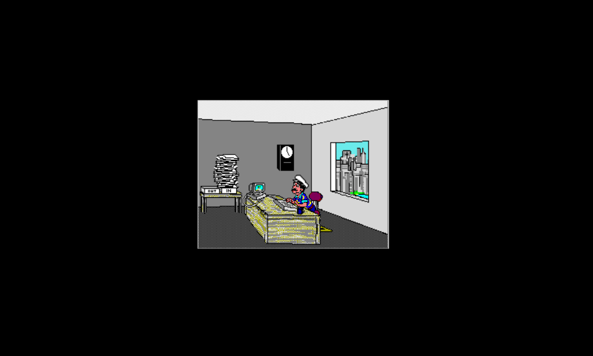
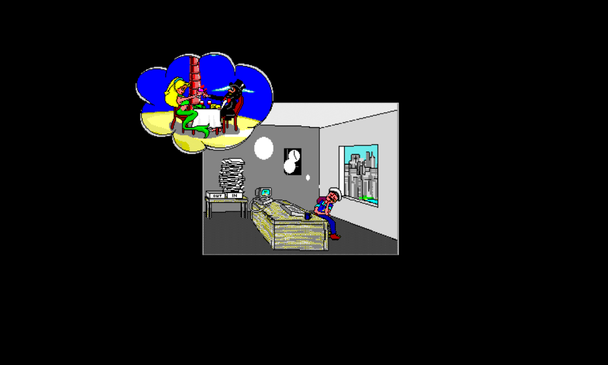
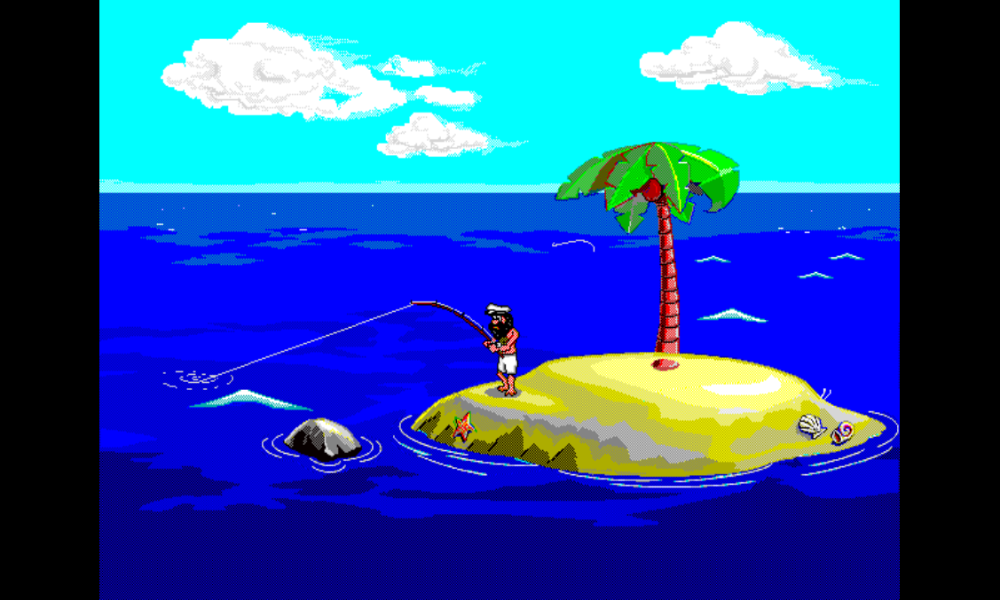
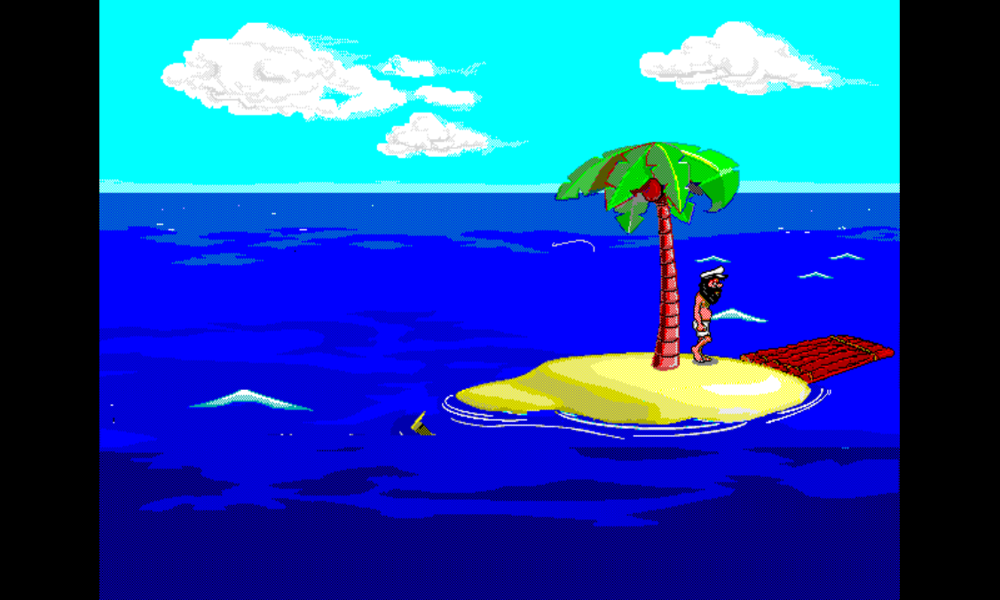
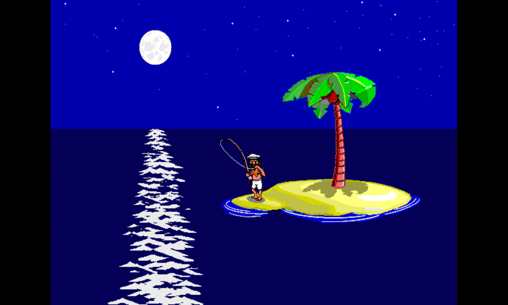
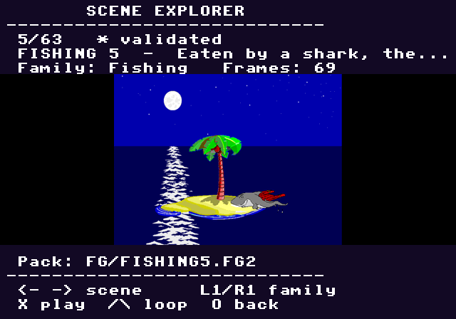
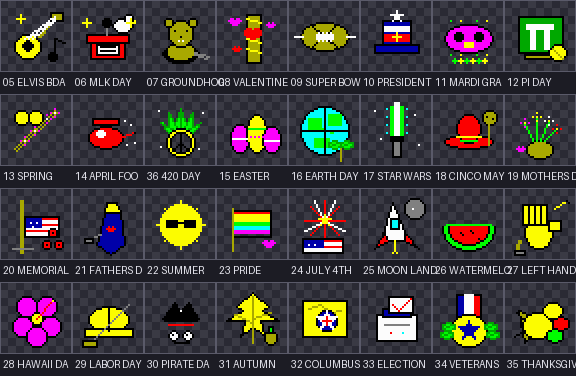
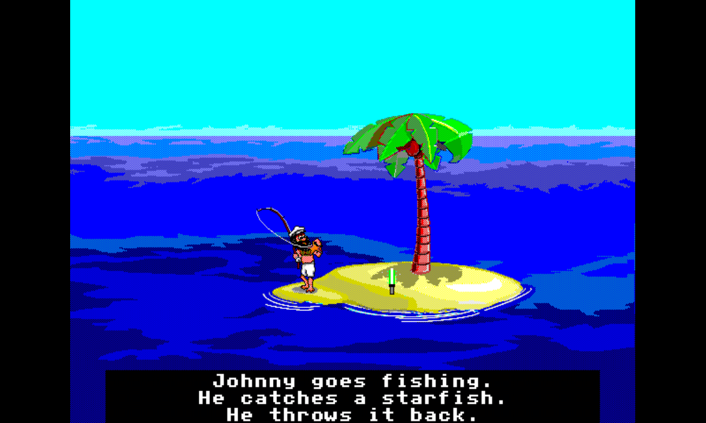

# Johnny Castaway — PlayStation 1

A PS1 port of Sierra's classic *Johnny Castaway* screen saver. All 63
scenes are validated under the project's pixel-perfect visual + synced-SFX
bar. The runtime is a hybrid pipeline — the desktop host captures every
scene from the real Sierra engine into authored foreground packs; the PS1
replays those packs and owns only the narrow surface it must (background,
wave animation, holiday overlays, controller input, SPU audio).

> **Website ▸ [hunterdavis.com/johnny-castaway-ps1](https://hunterdavis.com/johnny-castaway-ps1/)** — full project site with the live scene ledger, performance battle card, deep-dive essays, devlog, and history. *This README is the short version.*

**Quick links:** [Download](#download-and-play) · [Status](#status) · [Quick start](#quick-start) · [Method](#method) · [Pause menu](#pause-menu) · [Captions](#closed-captions) · [Holidays](#holidays) · [Hardware](#hardware-target) · [Controls](#controls) · [Documentation](#documentation) · [Acknowledgements](#acknowledgements) · [License](#license)

<p align="center">
  
  
</p>

<p align="center"><code>JOHNNY 6</code> on PS1 — office daydream · island date dream.</p>

<p align="center">
  
  
  
</p>

<p align="center"><code>FISHING 1</code> — the project's reference scene: daytime cast · raft variant · night variant.</p>

## Download and play

Latest release → **[Releases page](https://github.com/huntergdavis/johnny-castaway-ps1/releases/latest)** · or read the **[Play page](https://hunterdavis.com/johnny-castaway-ps1/play/)** for the full quickstart with controller map.

Direct download (auto-tracks the latest tag):

- **[jcreborn.bin](https://github.com/huntergdavis/johnny-castaway-ps1/releases/latest/download/jcreborn.bin)** — PS1 CD image
- **[jcreborn.cue](https://github.com/huntergdavis/johnny-castaway-ps1/releases/latest/download/jcreborn.cue)** — cuesheet

Load `jcreborn.cue` in [DuckStation](https://www.duckstation.org/) (or any PS1 emulator). Boots straight into the screensaver loop; press **Start** for the pause menu.

## Status

| | |
|---|---|
| Current release | **`v0.8.16-ps1`** — memory-region allocator stability release |
| Reference bar | **`FISHING 1`** — pixel-perfect visuals + synced SFX across every applicable variant (night / low-tide / holiday / raft-stage) |
| Scenes validated | **63 / 63** — see the live [scene ledger](https://hunterdavis.com/johnny-castaway-ps1/scenes/) or [`docs/ps1/scene-status.md`](docs/ps1/scene-status.md) |
| Headless perf | **126 / 126** scene/tide rows are routed and timing-bearing; refreshed public-capped average is **+0.2149% over target / 99.7875% target speed** after the WALKSTUF1-high entry `58..61` tail-trim/phase-3 speed promotion, the BUILDING2-high fixed-footprint physical compaction speed promotion moved B2-high into green, the VISITOR3-low additive `55..79` CACHE setup-segment headroom pass, the VISITOR3-low frame134 D4 data-shape headroom pass, the VISITOR3-low one-VBlank phase retime, the VISITOR3-low slack-knee speed promotion, the W1-low compact trim/retarget phase promotion moved WALKSTUF1 low into green, plus the W1-high one-VBlank phase retime, the BUILDING2-high entries `89..91` fixed-layout trim headroom pass, the BUILDING2-high one-VBlank phase retime, the VISITOR3-high segment3 `48..55` exact-clean/phase3 speed promotion, the local-LZ and D4 decoder inline code-headroom passes, the W1-high entries `183..191` fixed-layout previous-visible cleanup headroom pass, the VISITOR3-low fixed-layout cleanup/canonicalization passes, the WALKSTUF1 and BUILDING2 screen-clip/data-shape headroom passes, the VISITOR3-low D4/read-group speed promotions, and the allocator-era retained setup/CD-pressure promotions. Live battle card at [/perf/](https://hunterdavis.com/johnny-castaway-ps1/perf/) · CSV at [`performance-scene-matrix.csv`](docs/ps1/performance-scene-matrix.csv) |
| Perf harness | `--require-improvement` gates now fail if the supplied baseline summary has no matching case label, preventing false-pass optimization promotions. |
| Acceptance gate | human visual + audible signoff |

The mainline shifted from "prove every scene" to **performance polish, stability, and content** at `v0.7.0-ps1`. Current mainline builds on `v0.8.16-ps1` with the memory-region allocator promoted: BOOT allocations seal after startup, CACHE allocations use free-list/LRU reuse for long-lived resource data, and TRANSIENT scene allocations can be wiped between major scene loads instead of relying on a fragmented general heap.

The latest full matrix remains `126 / 126` routed and timing-bearing with 0 BSODs in the R34 allocator validation run; the latest four-yellow promotion gate is `scratch/ps1-perf-iterate/w1high-entry58-61-tail-phase3-four-yellow-canonical-current-20260522/20260522-134441-1556405/summary.json`. Public rollup is `+0.2149%` over target / `99.7875%` target speed and raw signed rollup is about `-0.5020%` / `100.5178%`; bands are `123` green, `3` yellow, `0` orange, and `0` red. That is about `17.19` public over-target points removed and `12.69` public target-speed points added since the compact full-matrix baseline.

The newest WALKSTUF1-high speed promotion trims fixed-offset entry tails for
entries `58..61` in `WALKSTUF1.FG2` and raises the high-tide phase offset to
`3`, preserving the `1535263` byte pack footprint, LBA `24891`, sectors `750`,
and `233472` byte PS-EXE bucket. Active payload drops `840654 -> 833386`;
W1-high improves from `1808/1471/1441` to `1808/1469/1440`, overrun
`30 -> 29`, blocking/refill `43/13 -> 42/12`, and target speed
`97.961% -> 98.026%`. BUILDING2 high and VISITOR3 high/low stay exact-flat
under canonical boot variants.

The prior BUILDING2-high speed promotion physically compacts
`BUILDING2.FG2` while padding back to the original `1303332` byte file size,
LBA `6189`, sectors `637`, and `233472` byte PS-EXE bucket. It trims the
previously phase-negative entries `76`/`77` only inside the compacted payload
layout, drops active payload `527884 -> 520974`, and passes the strict
four-yellow pixel/timing gate. B2-high improves from `1583/1340/1314` to
`1570/1330/1317`, overrun `26 -> 13`, blocking/refill `45/12 -> 32/12`,
loop reads `42 -> 33`, and due misses `7 -> 4`, moving the row into green at
`99.023%` target speed.

The newest CD-headroom promotion adds a fourth VISITOR3-low retained setup
slice for sectors `55..79` in `MEM_REGION_CACHE`, preserving the accepted
`281..305`, `150..177`, and `206..232` TRANSIENT slices. The promotion also
sets the low-tide VISITOR3 phase offset back to `0`; the new residency keeps
the current target cadence while cutting active CD pressure. The four-yellow
canary keeps VISITOR3 low at `1350/1065/1041`, overrun `24`, but improves
blocking/refill `55/0 -> 50/0`, loop reads `28 -> 18`, and due misses
`10 -> 8`; VISITOR3 high, WALKSTUF1 high, and BUILDING2 high stay exact-flat.
This does not change the speed rollup, but it gives the last VISITOR3-low
work a much lower CD-pressure baseline.

The previous data-shape headroom promotion D4-encodes VISITOR3-low frame `134`
against the previous decoded frame. The payload shrinks `17001 -> 14202`
bytes while file size, pack LBA, pack sectors, and the `233472` byte PS-EXE
bucket stay fixed. The four-yellow canary keeps VISITOR3 low, VISITOR3 high,
WALKSTUF1 high, and BUILDING2 high exact-flat; this does not change the speed
rollup, but it banks terminal decode/pack-shape headroom for the next
VISITOR3-low swing. Frame `136` and the combined `134`/`136` D4 form are
logged closed because they regressed VISITOR3-low timing.

The prior speed promotion adds a one-VBlank low-tide phase offset for
VISITOR3 low on top of the four-VBlank slack-knee baseline. The four-yellow
canary keeps VISITOR3 high, WALKSTUF1 high, and BUILDING2 high exact-flat
while VISITOR3 low improves `1338/1065/1040 -> 1339/1065/1041`, overrun
`25 -> 24`, and target speed `97.653% -> 97.746%`; pack LBA and the `233472`
byte PS-EXE bucket stay fixed. Phase `2`, `3`, and `4` were rejected because
they spent the target gain as visible/refill phase debt.

The prior code-headroom promotion makes `JCPERF2` the default perf summary
path and compiles the legacy `JCPERF` summary behind
`PS1_PERF_LEGACY_TRACE=1`. `ps1PerfEndScene()` is now scoped to `-Os`, shrinking
that scene-end reporting symbol to `0xf4` bytes while the `233472` byte PS-EXE
bucket, foreground LBAs, and all four current under-green timing rows stay
exact-flat. This does not change the public speed rollup; it banks code and
layout headroom for the remaining generated-owner/data-shape swings.

The prior speed promotion lowers the VISITOR3-low dual-segment window guard from five to four VBlanks. The four-yellow canary keeps VISITOR3 high, WALKSTUF1 high, and BUILDING2 high exact-flat while VISITOR3 low improves `1342/1069/1039 -> 1338/1065/1040`, overrun `30 -> 25`, blocking `68 -> 55`, and target speed `97.194% -> 97.653%`; pack LBA and the `233472` byte PS-EXE bucket stay fixed. The more aggressive three-VBlank guard is logged closed because it cut blocking but regressed VISITOR3 low to `1354/1081/1039` with refill overrun `24`. The current under-green queue remains VISITOR3 low, VISITOR3 high, WALKSTUF1 high, and BUILDING2 high.

A prior code-headroom pass caches the active foreground scene ID so hot
scheduler paths no longer repeat scene-name string compares. The five-yellow
canary stays exact-flat, the PS-EXE remains in the `233472` byte bucket, and
the tracked foreground hot symbols shrink (`foregroundPilotPlay -84`,
`fgRuntimeLoadSceneFrame -52`, `fgRuntimeFillWindowForEntry -24`, and
`fgRuntimeTryPrefetchWindow -12` bytes). This does not change the public speed
rollup, but it lowers code-size pressure for the next generated-owner and
custom data-shape swings.

The previous code-headroom pass removes the function-scoped `noinline`/`Os`
guard from `fgDecodeFrameDelta()` and lets the current foreground `-Os` build
inline the D4 decoder into `fgRuntimeLoadSceneFrame()`. The five-yellow canary
stays exact-flat, the `233472` byte PS-EXE bucket and pack LBAs stay fixed,
and the standalone `0x20c` decoder symbol disappears while `foregroundPilotPlay`
moves `-108` bytes. The paired noinline `O2` variant is logged closed because
it only shifted hot code by `+20` bytes with no timing or work win.

The newest code-headroom pass applies the same safe-inline treatment to
`fgDecodeLocalLzPayload()`. The standalone `0x1dc` local-LZ decoder disappears,
`fgRuntimeLoadSceneFrame` absorbs the checks, `foregroundPilotPlay` moves
another `-124` bytes, and the five-yellow canary remains exact-flat. This
removes the last foreground function-scoped `Os` decoder from the current O2
audit without changing speed totals.

The broad five-yellow prepare-first scheduler generalization is closed as a
failed big swing: VISITOR3 high/low and WALKSTUF1 high/low stayed exact-flat,
but B2-high regressed `1341/1313 -> 1345/1311` with blocking/refill
`47/14 -> 55/21`. The accepted WALKSTUF1-specific prepare-first rule remains,
but the remaining scheduler work needs generated deadline/refill ownership or
scene-specific data-shape changes rather than a broader hot C predicate.

The v0.8.13 checkpoint also extended BUILDING2 high preserve-offset payload trims through `building2-high-frame100-inplace-v926`: entry `172` / source frame `231` shrinks `1831 -> 851` bytes, entry `171` / source frame `228` shrinks `1980 -> 1025` bytes, entry `96` / source frame `119` shrinks `8781 -> 7944` bytes, entry `170` / source frame `226` shrinks `1683 -> 1186` bytes, entry `97` / source frame `121` shrinks `8718 -> 8258` bytes, entry `98` / source frame `123` shrinks `8876 -> 8637` bytes, entry `174` / source frame `239` shrinks `1625 -> 1460` bytes, entry `99` / source frame `126` shrinks `8843 -> 8728` bytes, entry `168` / source frame `219` shrinks `1372 -> 1266` bytes, entry `169` / source frame `223` shrinks `1820 -> 1495` bytes, entry `173` / source frame `235` shrinks `1765 -> 1134` bytes, and entry `100` / source frame `129` shrinks `8701 -> 8621` bytes. The current B2-high work-volume baseline then trims entries `92`, `94`, and `95` (`8834 -> 6370`, `8873 -> 6939`, `10247 -> 8827`) without moving pack offsets, aliases duplicate entries `141`/`142` to setup-resident payloads and entry `38` to setup-edge duplicate entry `35`, trims early draw tails in entries `67`/`69`/`70`/`71`/`72`, banks safe follow-up tail trims in entries `74` and `78..82`, trims entries `89..91` (`8814 -> 4304`, `8849 -> 4769`, `8867 -> 5427`), trims the safe tail entries `101..104`, `141`, `175..177`, and `333`, then physically compacts the fixed-footprint pack while trimming entries `76`/`77`. Active payload is now `520974`, and the current B2-high speed baseline layers the allocator-era setup slices with the `83..95`, guarded `271..287`, and `315..327` scheduler rows plus the previous-visible and screen-clip promotions, then adds the one-VBlank phase retime. B2-high now measures `1330/1317`, overrun `13`, blocking/refill `32/12`, and loop reads/read time `33/149`.

Recent releases:

- Current VISITOR3-low additive `55..79` setup-residency headroom -
  `foreground_pilot.c` adds a fourth low-tide retained setup segment for
  sectors `55..79`, stores that extra 24-sector slice in `MEM_REGION_CACHE`,
  and preserves the three accepted TRANSIENT slices. The accepted four-yellow
  canary at
  `scratch/ps1-perf-iterate/v3low-seg4-add55-79-cache-phase0-four-yellow-current-20260522/20260522-083527-3978849/summary.json`
  keeps VISITOR3 low at `1350/1065/1041`, overrun `24`, with
  blocking/refill `50/0`, reads/due `18/8`; VISITOR3 high, WALKSTUF1 high,
  and BUILDING2 high stay exact-flat. Public/raw speed rollups remain
  `+0.2233%` / `99.7793%` and about `-0.4936%` / `100.5097%`, with bands
  unchanged at `122` green / `4` yellow.
- Prior VISITOR3-low frame134 D4 data-shape headroom - `VIST3LOW.FG2`
  encodes frame `134` against the previous decoded frame, and
  `foreground_pilot.c` marks that frame as previous-delta decoded. The accepted
  four-yellow canary at
  `scratch/ps1-perf-iterate/v3low-d4-frame134-four-yellow-current-20260522/20260522-074644-3700705/summary.json`
  keeps VISITOR3 low at `1339/1065/1041`, overrun `24`, blocking/refill
  `55/0`, reads/due `28/10`; VISITOR3 high, WALKSTUF1 high, and BUILDING2
  high stay exact-flat. Frame `134` shrinks `17001 -> 14202` bytes, while
  frame `136` and the combined `134`/`136` D4 variants are rejected as
  phase-negative. Public/raw speed rollups remain `+0.2233%` / `99.7793%`
  and about `-0.4936%` / `100.5097%`, with bands unchanged at `122` green /
  `4` yellow.
- Prior VISITOR3-low phase-retime speed promotion - `foreground_pilot.c`
  adds a one-VBlank low-tide phase offset after the accepted slack-knee
  baseline. The accepted four-yellow canary at
  `scratch/ps1-perf-iterate/v3low-phase1-four-yellow-norequire-current-20260522/20260522-064859-3374469/summary.json`
  improves VISITOR3 low `1338/1065/1040 -> 1339/1065/1041`, overrun
  `25 -> 24`, and target speed `97.653% -> 97.746%` while VISITOR3 high,
  WALKSTUF1 high, and BUILDING2 high stay exact-flat. Public rollup improves
  to `+0.2233%` over target / `99.7793%` target speed; raw signed rollup is
  about `-0.4936%` / `100.5097%`, with bands unchanged at `122` green / `4`
  yellow. Phase `2`, `3`, and `4` are rejected because they regress loop,
  target, blocking, or hidden refill.
- Prior VISITOR3-low slack-knee speed promotion - `foreground_pilot.c`
  lowers `FG_VISITOR3_LOW_DUAL_SEGMENT_MIN_SLACK_VBLANKS` from `5` to `4`.
  The accepted four-yellow canary at
  `scratch/ps1-perf-iterate/v3low-minslack4-four-yellow-norequire-current-20260522/20260522-060115-3102659/summary.json`
  improves VISITOR3 low `1342/1069/1039 -> 1338/1065/1040`, overrun
  `30 -> 25`, blocking `68 -> 55`, and target speed `97.194% -> 97.653%`
  while VISITOR3 high, WALKSTUF1 high, and BUILDING2 high stay exact-flat.
  Public rollup improves to `+0.2240%` over target / `99.7786%` target speed;
  raw signed rollup is about `-0.4929%` / `100.5089%`, with bands unchanged
  at `122` green / `4` yellow. The three-VBlank variant is rejected because it
  regressed VISITOR3 low to `1081/1039` with refill overrun `24`.
- Prior perf-reporting code-headroom promotion - PS1 perf summaries now emit
  the canonical `JCPERF2` line by default while the legacy `JCPERF` line is
  compile-gated behind `PS1_PERF_LEGACY_TRACE=1`. The four-yellow canary at
  `scratch/ps1-perf-iterate/perf-nolegacy-headroom-four-yellow-current-20260522/20260522-053213-2936568/summary.json`
  keeps VISITOR3 low/high, WALKSTUF1 high, and BUILDING2 high exact-flat with
  stable pack LBAs and the `233472` byte PS-EXE bucket. `ps1PerfEndScene`
  shrinks to `0xf4` bytes, so this banks code headroom without changing the
  public/raw speed rollups or the `122` green / `4` yellow distribution.
- Prior WALKSTUF1-low compact trim/retarget phase promotion - W1-low now uses
  the compacted `WALK1LOW.FG2` active payload (`752740 -> 708288`) with setup
  coverage retargeted to `179..283` plus `154..160`, a one-VBlank low-tide
  phase offset, and a one-VBlank low-tide window-slack guard. Pack
  file size/LBA/sectors and the `233472` byte PS-EXE bucket stay fixed while
  W1-low improves `1809/1470/1446 -> 1801/1461/1447`, overrun `24 -> 14`,
  blocking/refill `32/3 -> 31/2`, reads `24 -> 22`, and target speed
  `98.367% -> 99.042%`. VISITOR3 high/low, WALKSTUF1 high, and BUILDING2
  high stay exact-flat. Public rollup improves to `+0.2279%` over target /
  `99.7750%` target speed and bands move to `122` green / `4` yellow.
- Prior WALKSTUF1-high one-VBlank phase speed promotion - W1-high now waits
  one VBlank before `ps1PerfMarkLoopStart()`, preserving all pack LBAs and the
  `233472` byte PS-EXE bucket while improving `1808/1472/1441` to
  `1808/1471/1441`. Overrun drops `31 -> 30`, blocking/refill stay `43/13`,
  reads/due stay `41/7`, and the other four yellow rows stay exact-flat.
  Public rollup improves to `+0.2334%` over target / `99.7696%` target speed.
- Prior BUILDING2-high entries `89..91` fixed-layout trim promotion -
  `BUILDING2.FG2` keeps file size, offsets, LBA, sectors, and the PS-EXE
  bucket fixed while entries `89`, `90`, and `91` shrink `8814 -> 4304`,
  `8849 -> 4769`, and `8867 -> 5427`. Active payload drops
  `539990 -> 527960`; B2-high stays exact-flat at `1583/1340/1314`, overrun
  `26`, blocking/refill `45/12`, while loop reads/read time improve
  `44/192 -> 42/186`. The other four yellow rows stay exact-flat, so public
  rollup remains `+0.2340%` over target / `99.7691%` target speed.
- Prior BUILDING2-high one-VBlank phase speed promotion - B2-high now waits
  one VBlank before `ps1PerfMarkLoopStart()`, preserving all pack LBAs and the
  `233472` byte PS-EXE bucket while improving `1583/1341/1313` to
  `1583/1340/1314`. Overrun drops `28 -> 26`, blocking/refill drops
  `47/14 -> 45/12`, and the other four yellow rows stay exact-flat. Public
  rollup improves to `+0.2340%` over target / `99.7691%` target speed.
- Prior VISITOR3-high retained-segment/exact-clean speed promotion - segment3
  now targets relative sectors `48..55`, V3-high uses a six-rect exact clean
  capture instead of the overstated pack bbox, and a V3-high-only three-VBlank
  phase ballast leaves the measured loop at `1067/1045` with overrun `22`,
  blocking/refill `32/0`, reads/due `12/2`, fixed pack LBAs, and the same
  `233472` byte PS-EXE bucket. Public rollup improves to `+0.2352%` over
  target / `99.7679%` target speed.
- Prior local-LZ decoder inline code-headroom promotion — the standalone
  local-LZ decoder is inlined into `fgRuntimeLoadSceneFrame`, removing the
  `0x1dc` helper symbol and moving `foregroundPilotPlay` another `-124` bytes
  while keeping all five under-green rows exact-flat at the same public rollup.
- Prior D4 decoder inline code-headroom promotion — the standalone
  previous-frame D4 decoder is inlined into `fgRuntimeLoadSceneFrame`, removing
  the `0x20c` helper symbol while keeping all five under-green rows exact-flat
  at the same public rollup. This is headroom for generated-owner and
  row-reference codec work, not a VBlank speed win.
- Prior allocator-era optimization checkpoint - VISITOR3 high keeps the
  clean-relief/retained-setup stack through the `80 KiB` window, `64 KiB`
  clean cap, setup-edge `40..47`, and same-speed `42..49` pressure slide;
  VISITOR3 low keeps the third setup segment plus frame138/frame135 data-shape
  work and read groups `16..32`, `72..88`, and `88..104`; BUILDING2,
  WALKSTUF1, and BUILDING4 keep their retained setup/CD-pressure and
  data-shape promotions. At that checkpoint the under-green queue was VISITOR3
  low, WALKSTUF1 high, BUILDING2 high, VISITOR3 high, and WALKSTUF1 low.
- Prior W1-high entries `183..191` fixed-layout previous-visible cleanup promotion — `WALKSTUF1.FG2` keeps file size, offsets, LBA, sectors, and the PS-EXE bucket fixed while active payload drops `844162 -> 840654`, cleanup spans `2211 -> 885`, cleanup pixels `6670 -> 2265`, runtime restore bytes `509592 -> 500782`, and upload bytes `17182720 -> 17171200`. The five-yellow canary stays exact-flat at the same public rollup.
- Prior VISITOR3-low entry `109..112` fixed-layout canonicalization promotion — `VIST3LOW.FG2` keeps file size, offsets, LBA, and the PS-EXE bucket fixed while entries `109..112` shrink selected active payload `8170 -> 6004` bytes. The broad full-pack clip and raw `{46..58}` pair are logged closed as phase-negative; the five-yellow canary stays exact-flat at the same public rollup.
- Prior W1-high entry `127..131` fixed-layout screen-clip promotion — `WALKSTUF1.FG2` keeps file size, offsets, LBA, and the PS-EXE bucket fixed while entries `128..131` shrink selected active payload `24097 -> 21512` bytes, removing `625` offscreen cleanup pixels and `3511` offscreen draw pixels. The five-yellow canary stays exact-flat at the same public rollup.
- Prior W1-high entry `53` fixed-layout screen-clip promotion — `WALKSTUF1.FG2` keeps file size, offsets, LBA, and the PS-EXE bucket fixed while entry `53` / source frame `63` shrinks `3893 -> 2309` bytes, removing `8969` offscreen cleanup pixels and `1945` offscreen draw pixels. The five-yellow canary stays exact-flat at the same public rollup.
- Prior W1-low entry `90..99` fixed-layout canonicalization promotion — `WALK1LOW.FG2` keeps file size, offsets, LBA, and the PS-EXE bucket fixed while entries `90`, `91`, `92`, `94`, `95`, `96`, `98`, and `99` shrink from `47579 -> 44511` bytes with no cleanup/draw pixel removal. W1-low total active payload drops `755808 -> 752740`, and the five-yellow canary stays exact-flat at the same public rollup.
- Prior VISITOR3-high entry 62 cleanup-only headroom promotion — `VISITOR3.FG2` keeps file size, offsets, entry table sizes, LBA, and the PS-EXE bucket fixed while entry `62` / source frame `80` drops cleanup restore bytes `2724 -> 596`, cleanup spans `156 -> 88`, cleanup pixels `1362 -> 298`, runtime restore bytes `56312 -> 54184`, and upload bytes `18038400 -> 18012160`. The five-yellow canary stays exact-flat at the same public rollup.
- Prior W1-low frame 87..99 fixed-layout cleanup-slack promotion — `WALK1LOW.FG2` keeps file size, offsets, entry table sizes, LBA, and the PS-EXE bucket fixed while selected-entry active payload drops `755808 -> 751288`, cleanup spans `3322 -> 1605`, cleanup pixels `12700 -> 7209`, cleanup restore bytes `25400 -> 14418`, runtime restore bytes `439090 -> 430052`, upload bytes `17854720 -> 17838080`, dirty rows `27898 -> 27872`, and loop read time `146 -> 145`. The five-yellow canary stays exact-flat at the same public rollup.
- Current W1-high cleanup-only fixed-layout screen-clip promotion — `WALKSTUF1.FG2` clips exact entries `14`, `23`, `43`, `45`, `47`, `49`, `51`, `54`, `56`, `57`, `67`, `137`, and `147` while preserving file size, offsets, entry table sizes, LBA, and the PS-EXE bucket. The changed subset drops logical active payload `29339 -> 27643`, removes `18160` cleanup pixels with no draw-span removal, reduces runtime restore bytes `525020 -> 510842`, max restore bytes `12684 -> 7712`, and upload bytes `17185920 -> 17182720`, and keeps the five-yellow canary exact-flat at the same public rollup.
- Prior VISITOR3-low fixed-layout cleanup headroom promotion — `VIST3LOW.FG2` now uses previous-visible cleanup while preserving file size, offsets, entry table sizes, and LBA. Logical active payload drops `425729 -> 405835`, cleanup restore bytes drop `456786 -> 53456`, runtime restore bytes drop `467962 -> 64632`, max restore bytes drop `293544 -> 2962`, upload bytes drop `18113920 -> 17494400`, and the five-yellow canary stays exact-flat at the same public rollup.
- Prior BUILDING2-high no-decode trim-draw-tail headroom promotion — `BUILDING2.FG2` trims entries `74` and `78..82` while preserving file size and LBA. Active payload drops `548293 -> 539990`; B2-high and the other four yellow canary rows stay exact-flat. The prior `67`/`69`/`70`/`71`/`72` trim-tail speed subset dropped active payload `574094 -> 548293` and improved B2-high to `1341/1313` / `97.912%` target speed with overrun `28`, blocking `47`, and refill overrun `14`.
- Prior W1-high preserve-entry-size screen-clip promotion — `WALKSTUF1.FG2` clips cleanup-only entries `204..211` while preserving each entry's table `dataSize`, offset, file size, and LBA. Logical active payload drops `20365 -> 19645` for that subset, `12368` cleanup pixels are removed, and W1-high stays `1472/1441` / `97.894%` target speed with blocking/refill `43/13`.
- Prior VISITOR3-low preserve-entry-size screen-clip promotion — `VIST3LOW.FG2` clips screen-invisible cleanup/draw span work across `10` entries while preserving each entry's table `dataSize`, offset, file size, and LBA. Logical active payload drops `425729 -> 423647`, offscreen pixels removed are `38366` cleanup plus `2139` draw, and VISITOR3-low stays `1071/1039` / `97.012%` target speed.
- Prior W1-low preserve-entry-size screen-clip promotion — `WALK1LOW.FG2` clips screen-invisible cleanup/draw span work across `63` entries while preserving each entry's table `dataSize`, offset, file size, and LBA. Logical active payload drops `755808 -> 712808`, offscreen pixels removed are `73798` cleanup plus `39618` draw, and W1-low stays `1470/1446` / `98.367%` target speed while hidden refill improves `4 -> 3`.
- Prior BUILDING2-high preserve-entry-size screen-clip promotion — `BUILDING2.FG2` clips screen-invisible cleanup/draw span work across `25` entries while preserving each entry's table `dataSize`, offset, file size, and LBA. Logical active payload drops `574094 -> 520974`, offscreen pixels removed are `1982` cleanup plus `40166` draw, and B2-high improves to `1343/1312` / `97.692%` target speed with overrun `31`, blocking `50`, and refill overrun `17`.
- Prior VISITOR3-high screen-clip headroom promotion — `VISITOR3.FG2` clips offscreen cleanup spans in entries `101` and `116` after the previous-visible cleanup baseline. Active high-pack payload drops `437785 -> 436469`, `7393` offscreen cleanup pixels are removed, pack footprint/LBA stay fixed, and the five-yellow canary stays exact-flat.
- Prior VISITOR3-high cleanup-headroom promotion — `VISITOR3.FG2` uses previous-visible cleanup compaction for every safe changed entry except entry `62`, which is logged as phase-negative. Active high-pack payload drops `461631 -> 437785`, cleanup restore bytes drop `542088 -> 36092`, runtime restore bytes drop `471382 -> 56312`, and upload bytes drop `18785280 -> 18038400`; VISITOR3-high stays `1082/1045`, overrun `37`, with fixed pack footprint/LBA.
- Prior BUILDING2-high cleanup-speed promotion — `BUILDING2.FG2` uses broad previous-visible cleanup compaction. Active high-pack payload drops `663590 -> 574094`, cleanup restore bytes drop `439186 -> 80522`, runtime restore bytes drop `438988 -> 116648`, and upload bytes drop `26753280 -> 24341120`; B2-high improves to `1343/1311` / `97.617%` target speed, overrun `32`, with fixed pack footprint/LBA.
- Prior W1-low cleanup-headroom promotion — `WALK1LOW.FG2` uses previous-visible cleanup compaction on late frames `194`, `196`, `198`, `200`, `202`, `206`, `208`, and `210`. Active low-pack payload drops `764658 -> 755808`, late cleanup restore bytes drop `49892 -> 574`, pack footprint/LBA stay fixed, and the refreshed five-yellow canary stays exact-flat.
- Current code-headroom promotion — the foreground scheduler now caches the active scene ID once per scene start and uses that ID in hot per-frame checks. Five yellow rows stayed exact-flat, the `233472` byte PS-EXE bucket and pack LBAs stayed fixed, and `foregroundPilotPlay`/window-fill/load/prefetch hot symbols shrank by `172` bytes combined.
- `v0.8.16-ps1` — memory-region allocator stability release. Introduces BOOT/CACHE/TRANSIENT allocation regions, scene-boundary transient wipes, CACHE free-list/LRU reuse, generated pack-header metrics, and CI rationale gates for allocator call sites. The R34 full matrix remains `126/126` PASS with 0 BSODs. Release battle card after the allocator refresh was `+0.5699%` over target / `99.4843%` target speed; bands were `118` green, `4` yellow, `2` orange, and `2` red.
- `v0.8.15-ps1` — WALKSTUF1 high setup-resident CD promotion. High tide primes relative sectors `242..388` during setup, improving the active loop/target from `1481/1428` to `1476/1441`, overrun `53 -> 35`, blocking/refill `88/24 -> 49/17`, reads/read time `67/287 -> 37/182`, and due `15 -> 7`. Public rollup improves to `+0.2285%` over target / `99.7746%` target speed; bands remain `119` green and `7` yellow.
- `v0.8.14-ps1` — JOHNNY1 local-LZ green promotion. Both JOHNNY1 tides compress full-frame entries `1` and `50` in-place behind a scene-local sentinel stream, preserving the `448370` byte high/low pack footprints, pack LBAs/sectors, and the `217088` byte PS-EXE bucket while improving both rows to `1948/1945`, overrun `3`, blocking/refill `5`, and target speed `99.85%`. Public rollup improves to `+0.2492%` over target / `99.7548%` target speed; bands are `119` green and `7` yellow.
- `v0.8.13-ps1` — under-99 payload-work checkpoint. WALKSTUF1 low advances to `walkstuf1-low-frame106-inplace-v910`, BUILDING2 high advances to `building2-high-frame173-inplace-v914`, BUILDING4 low advances to `building4-low-frame283-inplace-v913`, and the JOHNNY1 black-clear, BUILDING2 high early-row, and WALKSTUF1 low frame132 misses are logged as closed. Public rollup is `+0.2697%` over target / `99.7347%` target speed; bands remain `117` green and `9` yellow.
- `v0.8.12-ps1` — WALKSTUF1 low advances to `walkstuf1-low-frame130-inplace-v795`: frames `77` and `130` shrink in-place on top of the restored lazy-stream baseline without moving pack offsets, keeping `1770/1478/1431`, blocking/refill `64/20`, read time `60/272`, and due `11` exact-flat while active payload drops `879801 -> 799694`. Public rollup remains `+0.2708%` over target / `99.7337%` target speed; bands remain `117` green and `9` yellow.
- `v0.8.11-ps1` — corrective point release after `v0.8.10`: restores lazy CD/FG stream buffers after a heap-fragmentation merge pinned `256 KB` of CD sector pool plus boot-time FG stream buffers and caused W1-low to skip after a clean-rect allocation failure. The accepted rollback returns W1-low exact-flat to the v791 baseline at `1770/1478/1431`, blocking/refill `64/20`, read time `60/272`, and due `11`. Public rollup remains `+0.2708%` over target / `99.7337%` target speed; bands remain `117` green and `9` yellow.
- `v0.8.10-ps1` — WALKSTUF1 low continues the no-shift payload-reduction lane through `walkstuf1-low-frame76-inplace-v791`: frames `51`/`49`/`47`/`61`/`62`/`58`/`45`/`37`/`35`/`43`/`41`/`57`/`33`/`67`/`68`/`69`/`32`/`133`/`5`/`141`/`70`/`30`/`6`/`71`/`72`/`142`/`73`/`131`/`74`/`19`/`28`/`138`/`145`/`75`/`76` now shrink in-place without moving pack offsets. Timing stays exact-flat at `1478/1431`, blocking/refill `64/20`, read time `60/272`, and due `11`, while active payload drops `879801 -> 801103`. Public rollup remains `+0.2708%` over target / `99.7337%` target speed; bands are `117` green and `9` yellow.
- `v0.8.9-ps1` — VISITOR5 low uses the low-tide `30..46` retained-read group, improving from `1104/1092` to `1102/1097` and moving that row into green. WALKSTUF1 low gained the same-speed shared `427..443` CD-work row, then high/low late-tail and isolated low offscreen work-volume clips through v726, followed by v705 low late-tail physical compaction that cuts loop reads/read time `62/281 -> 60/274` on the clean current baseline while staying exact-flat at `1478/1431`; v747/v749/v750/v751/v753/v755/v756/v757/v759/v762/v763/v766/v767/v769/v770/v771/v772/v773/v774/v775/v776/v777/v779/v780/v781/v782/v783/v784/v785/v786/v787/v788/v789/v790/v791 now cut low frame51/frame49/frame47/frame61/frame62/frame58/frame45/frame37/frame35/frame43/frame41/frame57/frame33/frame67/frame68/frame69/frame32/frame133/frame5/frame141/frame70/frame30/frame6/frame71/frame72/frame142/frame73/frame131/frame74/frame19/frame28/frame138/frame145/frame75/frame76 active payload in-place while staying exact-flat, and the v760 mainline fast-poll follow-up restores the current row to `1478/1431`, blocking/refill `64/20`, read time `60/272`. W1-high frames `55`, `138`, `51`, `49`, `47`, and `45` now clip safe offscreen draw spans and drop the high runtime work to `17011/131649/745213` while staying exact-flat at `1476/1434`. BUILDING2 low `218..229` slack8 first improves `1349/1320 -> 1344/1318`, and v739 draw-tail trimming now improves it to `1339/1317`, overrun `22`, blocking `53`, reads/read time `37/150`, and due `12`. BUILDING2 high now has exact-flat offscreen work-volume clips for frames `89..92`, `94..104`, and `168..177`. VISITOR3 high tail repack improves `1065/1039 -> 1063/1040`, overrun `26 -> 23`, blocking `41 -> 35`, and reads/due `7/7 -> 6/6`; BUILDING4 low offscreen pack clipping improves `2856/2816 -> 2853/2816`, overrun `40 -> 37`, blocking `44 -> 40`, and refill `37 -> 34`, then v746 cuts frame291 active payload in place while staying exact-flat. Public rollup is `+0.2708%` over target / `99.7337%` target speed; raw signed rollup is `-0.4963%` / `100.5160%`; bands are `117` green and `9` yellow.
- `v0.8.8-ps1` — VISITOR5 high now uses a high-tide `30..46` retained-read group, improving to `1101/1096`, overrun `5`, blocking/refill `5`, reads/due `18/0`, and moving that row into green. Public rollup is `+0.2867%` over target / `99.7183%` target speed; raw signed rollup is `-0.4805%` / `100.5006%`; bands are `116` green and `10` yellow.
- `v0.8.7-ps1` — deterministic BOOTMODE scene selection, expected-scene gates in the headless perf harness, Suzy backdrop cleanup hardening, and heapless Scene Explorer thumbnail streaming. Public rollup remains `+0.3156%` over target / `99.6902%` target speed.
- `v0.8.6-ps1` — WALKSTUF1 low gap6-prefix + slack-guard promotion, WALKSTUF1 high window-prefetch / slack4 guard, and VISITOR3 high/low setup-segment resident copies for frames `131` / `128`. Public rollup `+0.3157%` over target / `99.6902%` target speed.
- `v0.8.5-ps1` — full 126-row headless performance matrix baseline.
- `v0.8.4-ps1` — on-PS1 captured thumbnails for every Scene Explorer slot; per-scene metadata reconciled against what the discs play. [Retrospective.](https://hunterdavis.com/johnny-castaway-ps1/lab/chapter-select-grind/)
- `v0.8.3-ps1` — WALKSTUF1 compact FGP3/v4 restore-minus-current packs.
- `v0.8.2-ps1` — VISITOR3 guarded-read group performance promotion.
- `v0.8.1-ps1` — clean-rect pressure-estimator stability fix surfaced by long randomized soak. [Retrospective.](https://hunterdavis.com/johnny-castaway-ps1/lab/v081-mary4-freeze/)
- `v0.8.0-ps1` — complete-scene performance baseline. [Retrospective.](https://hunterdavis.com/johnny-castaway-ps1/lab/from-87-to-99-5/)

Full release history at **[/releases/](https://hunterdavis.com/johnny-castaway-ps1/releases/)**. Per-release release notes live in [`docs/ps1/release-notes-*.md`](docs/ps1/).

## Quick start

**Prerequisites:** Docker (the build runs in `jc-reborn-ps1-dev:amd64` with PSn00bSDK 0.24 baked in), DuckStation, and the original Sierra data files (see [Original data files](#original-data-files) below).

```bash
./scripts/rebuild-and-let-run.sh noclean
```

Builds the PS1 EXE, packs `jcreborn.bin` / `jcreborn.cue` via `mkpsxiso`, launches DuckStation, and boots into `FISHING 1` via `BOOTMODE.TXT`. Default mode is the screensaver loop (each replay randomizes night / low-tide / raft / holiday). Add `noloop` to the boot string for a single-shot play.

A watchdog (`RUN_TIMEOUT_SECONDS`, default 300s) kills the emulator if it's left running; override with `RUN_TIMEOUT_SECONDS=<n>` or `0` to disable.

To bring up a new scene, see **[/docs/dev-workflow/](https://hunterdavis.com/johnny-castaway-ps1/docs/dev-workflow/)** ([raw](docs/ps1/development-workflow.md)).

## Original data files

The CD image build needs Sierra's original `Johnny Castaway` data files locally:

| File | Bytes | md5 |
|---|---:|---|
| `RESOURCE.MAP` | 1,461 | `8bb6c99e9129806b5089a39d24228a36` |
| `RESOURCE.001` | 1,175,645 | `374e6d05c5e0acd88fb5af748948c899` |

Drop them under `jc_resources/`. The repo tracks extracted VAGs and other derived artifacts; the master files are gitignored and must be present locally.

Optional — sound effects from [JCOS resources](https://github.com/nivs1978/Johnny-Castaway-Open-Source/tree/master/JCOS/Resources):

<details>
<summary><code>sound0..sound24.wav</code> expected hashes</summary>

| File | Bytes | md5 |
|---|---:|---|
| `sound0.wav` | 10,768 | `53695b0df262c2a8772f69b95fd89463` |
| `sound1.wav` | 11,264 | `35d08fdf2b29fc784cbec78b1fe9a7f2` |
| `sound2.wav` | 1,536 | `f93710cc6f70633393423a8a152a2c85` |
| `sound3.wav` | 7,680 | `05a08cd60579e3ebcf26d650a185df25` |
| `sound4.wav` | 5,120 | `be4dff1a2a8e0fc612993280df721e0d` |
| `sound5.wav` | 3,072 | `24deaef44c8b5bb84678978564818103` |
| `sound6.wav` | 15,872 | `eb1055b6cf3d6d7361e9a00e8b088036` |
| `sound7.wav` | 15,360 | `cab94bace3ef401238daded2e2acec34` |
| `sound8.wav` | 2,560 | `39515446ceb703084d446bd3c64bfbb0` |
| `sound9.wav` | 3,584 | `f86d5ce3a43cbe56a8af996427d5c173` |
| `sound10.wav` | 20,480 | `5b8535f625094aa491bf8e6246342c77` |
| `sound12.wav` | 5,632 | `8c173a95da644082e573a0a67ee6d6a3` |
| `sound14.wav` | 11,776 | `e064634cfb9125889ce06314ca01a1ea` |
| `sound15.wav` | 3,072 | `b3db873332dda51e925533c009352c90` |
| `sound16.wav` | 7,680 | `2eabfe83958db0cad77a3a9492d65fe7` |
| `sound17.wav` | 4,608 | `2497d51f0e1da6b000dae82090531008` |
| `sound18.wav` | 14,336 | `994a5d06f9ff416215f1874bc330e769` |
| `sound19.wav` | 3,584 | `5e9cb5a08f39cf555c9662d921a0fed7` |
| `sound20.wav` | 7,680 | `80e7eb0e0c384a51e642e982446fcf1d` |
| `sound21.wav` | 5,120 | `1a3ab0c7cec89d7d1cd620abdd161d91` |
| `sound22.wav` | 1,536 | `a0f4179f4877cf49122cd87ac7908a1e` |
| `sound23.wav` | 2,048 | `52fc04e523af3b28c4c6758cdbcafb84` |
| `sound24.wav` | 9,728 | `5a6696cda2a07969522ac62db3e66757` |

</details>

## Method

The PS1 build is deliberately hybrid, not a from-scratch engine rewrite:

1. **Desktop host** runs Sierra's TTM/ADS interpreter and captures every visible foreground draw plus every `PLAY_SAMPLE` opcode into a per-frame JSON bundle.
2. A **pack compiler** turns that capture into PS1-native FG2 / FGP3 packs — high-tide and low-tide base-diff spans plus a per-frame sound-event table.
3. On **PS1**, [`foreground_pilot.c`](src/foreground_pilot.c) loads the pack and stamps captured frames in step with a narrow runtime that handles background, wave animation, holiday overlay, and SPU playback. SFX fire on cue with a 3-frame delay so sample key-on matches the visible trigger.

Full pipeline — pack format byte layout, hardware constraints hit on the way, the SPI pad-poll fix, dirty-rect bookkeeping — at **[/about/method/](https://hunterdavis.com/johnny-castaway-ps1/about/method/)**.

## Pause menu

<p align="center">
  
</p>

<p align="center">Pause → <strong>Scene Explorer</strong>: jump straight to any of the 63 scenes. Each entry shows the captured-on-PS1 thumbnail, family, frame count, and pack name. New in <code>v0.8.4-ps1</code>; full reference at <a href="https://hunterdavis.com/johnny-castaway-ps1/docs/pause-menu/#scene-explorer">/docs/pause-menu/#scene-explorer</a>.</p>

Press **Start** mid-scene. Twelve sub-screens reachable from the main pause overlay:

- **Scene Set** · **Scene Explorer** — pool selector across seven categories, plus the chapter-select grid above.
- **Freeplay: ON / OFF** · **Freeplay Options** — direct-control Johnny mode plus its gag, visitor, and controls catalogs.
- **World Options** — day/night, tide, raft stage, holidays, island position.
- **Accessibility** — captions, sound, ocean ambience, Sound Test.
- **System** — save to memcard, set time/date, set RNG seed, perf log, reset scene, next scene.

Auto-generated walkthrough with screenshots of every menu screen at **[/help/menu/](https://hunterdavis.com/johnny-castaway-ps1/help/menu/)**.

## Holidays

<p align="center">
  
</p>

The original Sierra game shipped four baked-in holiday decorations (Christmas, New Year, Halloween, St. Patrick's). This port extends that to **36 US holidays** via a code-generated table and a pure-algorithm date core (Meeus for Easter, Nth-weekday math for the others) — no external date library, no expiring tables, works for 100+ years. Reference at **[/docs/holidays/](https://hunterdavis.com/johnny-castaway-ps1/docs/holidays/)**.

## Closed captions

<p align="center">
  
</p>

Pause → **Accessibility** → **Captions: ON**. A dark band appears at the bottom of the frame for ~5 seconds at scene start with a short descriptive subtitle. Off by default; the toggle persists to memcard. Glyph atlas is shared with the pause menu (one font upload, no duplication).

The corpus was authored fresh from scene content — see [`docs/ps1/caption-audit-2026-04-26.yaml`](docs/ps1/caption-audit-2026-04-26.yaml) for confidence ratings, and **[/docs/captions/#post-validation-runtime-corrections-v084-ps1](https://hunterdavis.com/johnny-castaway-ps1/docs/captions/#post-validation-runtime-corrections-v084-ps1)** for the v0.8.4 chapter-select-grind reconciliation (several scene-to-caption mappings drifted from the on-PS1 gags and have been corrected on the website's per-scene pages — the runtime `captionSceneMap[]` is open work).

Implementation: [`src/ps1_captions.c`](src/ps1_captions.c) / [`.h`](src/ps1_captions.h) (corpus + renderer), [`src/foreground_pilot.c`](src/foreground_pilot.c) (per-scene fire), [`src/graphics_ps1.c`](src/graphics_ps1.c) (`captionsRender()` inside `grUpdateDisplay`).

## Hardware target

| | |
|---|---|
| Main RAM | 2 MB |
| VRAM | 1 MB |
| SPU RAM | 512 KB (all 23 SFX VAGs preloaded at boot) |
| Output | 640 × 480 interlaced, NTSC |

Every rendering decision is forced by this budget. A full-frame video approach was ruled out early (614 KB per 640×480 16-bit frame × 63 scenes ≈ gigabytes); the hybrid-playback model sidesteps that by keeping foreground content in authored packs and a narrow runtime for background / waves / overlays.

Reference + the gotchas hit in practice at **[/docs/hardware/](https://hunterdavis.com/johnny-castaway-ps1/docs/hardware/)**.

## Controls

Normal screensaver mode needs no input. Press **Start** to open the pause menu.

| Control | Action |
|---|---|
| Start | Open pause menu / resume |
| D-pad / left analog | Move cursor or adjust values |
| Cross | Select / apply |
| Circle | Back from any menu or submenu |

**Freeplay** (launched from the pause menu) gives direct control of Johnny:

| Control | Action |
|---|---|
| D-pad / left analog | Walk Johnny; movement cancels the current action |
| L2 / R2 held | Slow / fast walk |
| Circle | Fish from the nearest side of the island |
| Select | Clear screen, cancel transient actions, rebuild island |
| R1 + Up / Down / Left / Right | Day/night · tide · raft stage · holiday |
| Start | Open pause menu |

## Documentation

The website is the rendered, cross-linked, prose-context view; the GitHub paths under `docs/ps1/` are the raw source. Pick whichever you prefer.

**Top-level surfaces**

- **[/play/](https://hunterdavis.com/johnny-castaway-ps1/play/)** — download + DuckStation quickstart + controls.
- **[/help/](https://hunterdavis.com/johnny-castaway-ps1/help/)** — auto-generated player help with menu screenshots.
- **[/scenes/](https://hunterdavis.com/johnny-castaway-ps1/scenes/)** — live ledger of all 63 scenes + per-scene case studies.
- **[/perf/](https://hunterdavis.com/johnny-castaway-ps1/perf/)** — 126-variant headless perf battle card.
- **[/about/](https://hunterdavis.com/johnny-castaway-ps1/about/)** — project overview ([method](https://hunterdavis.com/johnny-castaway-ps1/about/method/), [status](https://hunterdavis.com/johnny-castaway-ps1/about/status/), [history](https://hunterdavis.com/johnny-castaway-ps1/about/history/), [voice guide](https://hunterdavis.com/johnny-castaway-ps1/about/voice/), [dev environment](https://hunterdavis.com/johnny-castaway-ps1/about/dev-environment/)).
- **[/docs/](https://hunterdavis.com/johnny-castaway-ps1/docs/)** — eighteen reference manuals: build, captions, holidays, pause menu, freeplay, story-loop walks, regtest, scripted input, performance, hardware, audio, infrastructure, file formats, AI sub-agents, vision-classifier, the SDL2 → PSn00bSDK API mapping, dev workflow, glossary.
- **[/lab/](https://hunterdavis.com/johnny-castaway-ps1/lab/)** — sixteen feature-length retrospectives (LLM-assisted dev, hallucination control, build farm, regression practice, the soak-loop freeze, the chapter-select grind, the post-validation perf arc).
- **[/hack/](https://hunterdavis.com/johnny-castaway-ps1/hack/)** — for curious hackers: learning C from this codebase, porting Johnny to a new platform, the printf-driven perf loop, the visual-debug catalog.
- **[/archaeology/](https://hunterdavis.com/johnny-castaway-ps1/archaeology/)** — the full 5-chapter project story.
- **[/devlog/](https://hunterdavis.com/johnny-castaway-ps1/devlog/)** — dated worklogs preserved verbatim.
- **[/credits/](https://hunterdavis.com/johnny-castaway-ps1/credits/)** · **[/legal/](https://hunterdavis.com/johnny-castaway-ps1/legal/)** · **[/faq/](https://hunterdavis.com/johnny-castaway-ps1/faq/)**.

**Raw doc source** — [`docs/ps1/`](docs/ps1/) on GitHub. Notable entry points: [`scene-status.md`](docs/ps1/scene-status.md) (per-scene ledger), [`current-status.md`](docs/ps1/current-status.md) (narrative), [`development-workflow.md`](docs/ps1/development-workflow.md) (per-scene loop), [`performance-scene-matrix.csv`](docs/ps1/performance-scene-matrix.csv) + [`performance-experiment-log.md`](docs/ps1/performance-experiment-log.md) (perf source of truth), [`release-notes-*.md`](docs/ps1/) (per-release notes), [`research/`](docs/ps1/research/) (dated design logs ↔ `/devlog/`), [`archaeology/`](docs/ps1/archaeology/) (timeline, retired tools, vision-artifacts).

## Repo lineage

This project began as a branch of [jno6809/jc_reborn](https://github.com/jno6809/jc_reborn) focused on a PlayStation 1 port. It has diverged far enough — hybrid scene-playback pipeline, per-scene captures, FG2 / FGP3 pack format, PS1 SPU playback path, scene-by-scene validation ledger — that it now lives in its own repository. Without that engine decode this port wouldn't exist.

## Acknowledgements

Short list; the full version with context per name is at **[/credits/](https://hunterdavis.com/johnny-castaway-ps1/credits/)**.

- [jno6809/jc_reborn](https://github.com/jno6809/jc_reborn) — engine decode + the original Johnny Reborn project
- Hans Milling (`nivs1978`), [JCOS](https://github.com/nivs1978/Johnny-Castaway-Open-Source)
- Alexandre Fontoura (`xesf`), [Castaway](https://github.com/xesf/castaway)
- [Sierra Chest's Johnny Castaway archive](http://sierrachest.com/index.php?a=games&id=255&title=johnny-castaway)
- Jeff Tunnell · Kevin and Liam Ryan · Jaap · Gregori · Guido
- [PSn00bSDK](https://github.com/Lameguy64/PSn00bSDK) · [mkpsxiso](https://github.com/Lameguy64/mkpsxiso) · [DuckStation](https://github.com/stenzek/duckstation)
- BigSoundBank ("Sea: Waves" CC0) — ocean ambience source

## Transparency

Claude, Gemini, and OpenAI Codex were all used extensively across this project — for programming, debugging support, and generating prose for the website. Decisions and the merge bar are Hunter's; first drafts often were not. Full disclosure at **[/docs/agents/](https://hunterdavis.com/johnny-castaway-ps1/docs/agents/)** and on the footer of every page of the site.

## License

GPL-3.0, inherited from upstream `jc_reborn`.
